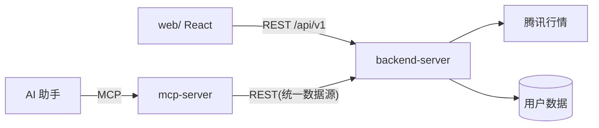

# API 标准(mp)

本目录以**「目录结构 = URL 路径」**的方式定义 mp 的统一 API 契约,同时服务 `web/`(前端 ↔ backend-server REST)与 `mcp-server`(MCP 工具)。

## 目录 = 路径约定

- `api/` 对应 URL 前缀 `/api`;`api/v1/` 对应 `/api/v1`;目录段即路径段。
- **叶子文件 = 端点详情**:文件名即路径末段(如 `stocks/search.md` = `GET /api/v1/stocks/search`)。
- **集合/资源根**:目录下 `index.md` 表示该资源本身(如 `watchlist/index.md` = `GET /api/v1/watchlist`)。
- **路径参数**:用 `{参数名}` 命名文件或目录(如 `stocks/{code}/kline.md` = `GET /api/v1/stocks/{code}/kline`);有子资源的参数节点用目录 + `index.md`,无子资源的用 `{code}.md` 叶子。
- **共享定义**:`api/v1/common/` 不映射 URL,存放全部类型 / 错误 / 鉴权 / 分页约定,叶子文档引用之。
- **子节点不单一**:该目录下新增 `README.md` 做资源总览(如 `stocks/README.md`、`formulas/README.md`)。

```
api/
  README.md             ← 本文件:总览 + 架构 + 实施分期
  mcp.md                ← MCP Server 工具/资源/提示(与 REST 端点映射)
  v1/
    README.md           ← v1 端点索引表
    common/             ← 共享定义(非 URL):types / error / auth / pagination
    stocks/  indicators/  watchlist/  browse-history/  formulas/
    indicator-config/   settings/   drawings/
```

## 总体架构



- 腾讯行情只由 backend-server 访问(缓存/限流/重试);web 与 mcp-server 不直连。
- 用户数据(自选/浏览记录/公式/配置/设置/画线)由 backend-server 持久化,取代 web 端 localStorage。
- 指标/公式计算引擎下沉共享层,web 与 backend/mcp 共用同一实现,结果一致。

## 版本与通用约定

- 当前设计版本:`v1`(端点索引见 `v1/README.md`)。
- 鉴权:`v1/common/auth.md`;错误结构:`v1/common/error.md`;分页:`v1/common/pagination.md`;全部类型:`v1/common/types.md`。
- MCP 工具定义:`mcp.md`。

## 实施分期

1. 以 `v1/common/types.md` 为契约事实源,生成 OpenAPI / MCP JSON Schema。
2. backend-server 按 `v1/` 目录落路由;web 改为消费 REST。
3. 指标/公式引擎下沉共享层(与 web `src/indicators` 一致)。
4. mcp-server 按 `mcp.md` 暴露工具。
