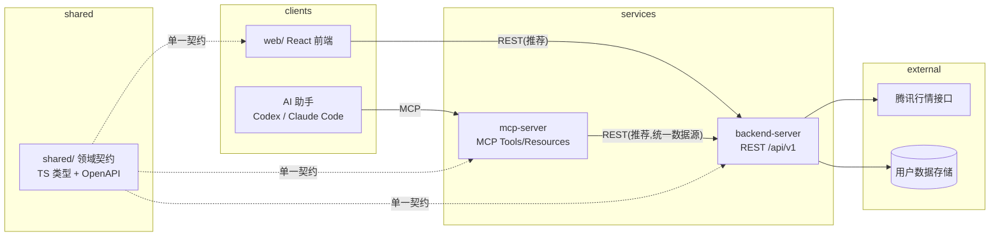

# mp 统一 API 设计

> 目标:基于现有 `web/` 已实现的功能,设计一套**同时满足「前端 ↔ 后端」REST 交互与「MCP Server」工具调用**的统一 API 定义,作为后续 `backend-server/` 与 `mcp-server/` 的落地契约。

---

## 1. 背景与目标

现状:行情、指标计算、用户数据(自选/浏览记录/公式/配置/设置/画线)全部在 `web/` 前端完成(行情直连腾讯接口,用户数据存 localStorage)。

目标:
1. **backend-server** 提供 REST API,承接行情代理(解决 CORS/限流/缓存)与用户数据持久化,`web/` 改为消费这些 API。
2. **mcp-server** 把同一套领域能力暴露为 MCP Tools / Resources,让 AI 助手(Codex / Claude Code 等)能查询行情、计算指标、管理自选与公式。
3. 两套入口**共享同一份领域契约**(类型 + 语义),保证 web 与 MCP 行为一致、避免重复定义。

## 2. 总体架构



- **数据来源唯一**:腾讯行情只由 `backend-server` 访问(服务端可加缓存/限流/失败重试),`web` 与 `mcp-server` 都不直连。
- **用户数据**:`web` 端 localStorage 逐步迁移到 `backend-server` 持久化;MCP 对同一用户数据的读写走同一套 API。
- **MCP 实现模式(推荐)**:`mcp-server` 内部作为 `backend-server` 的 REST 客户端,把每个工具映射到对应 API——单一数据源、鉴权/限流统一。备选:两端共享同一数据访问包(适合 MCP 需要离线独立运行的场景)。

## 3. 领域模型(共享契约)

`shared/`(或 `packages/contracts`)以 TypeScript 类型为唯一事实源,并用其生成 OpenAPI 与 MCP JSON Schema。核心类型:

```ts
// ---- 行情 ----
type KlinePeriod = 'day' | 'week' | 'month'
type Fq = 'qfq' | 'none'                        // 前复权 / 不复权

interface Stock {
  code: string        // 规范化代码,小写 sh/sz/bj + 6 位,如 sh600519
  name: string
  market: 'sh' | 'sz' | 'bj'
  kind: 'stock' | 'index' | 'fund' | 'etf'      // 类型(指数/股票/基金)
}

interface KlineBar {
  time: string        // 'YYYY-MM-DD'
  open: number
  high: number
  low: number
  close: number
  volume: number
}

interface KlineResponse {
  code: string
  name: string
  period: KlinePeriod
  fq: Fq
  bars: KlineBar[]
  /** 游标:拉取更早数据时传 bars[0].time 之前的日期;到底返回 null */
  nextBefore?: string | null
}

// ---- 指标 ----
interface IndicatorParam { key: string; value: number | number[] | string }
interface IndicatorCall {
  id: string                                    // 内置指标名 或 用户公式 id
  params?: IndicatorParam[]
  /** 公式 DSL:内置指标用字段/函数;用户公式用表达式/脚本(见 web/src/indicators/custom/formula.ts) */
  formula?: string
  formula2?: string                             // band 下轨(公式路径)
  shape?: 'line' | 'area' | 'histogram' | 'baseline' | 'band'
}
interface IndicatorOutput {
  key: string
  label: string
  type: 'line' | 'area' | 'histogram' | 'baseline' | 'band' | 'candlestick' | 'bar'
  data: Array<{ time: string; value: number } | { time: string; open: number; high: number; low: number; close: number }>
  lower?: Array<{ time: string; value: number }>   // band 下轨
}
interface IndicatorCalcRequest {
  code?: string           // 二选一:服务端拉 K 线计算
  bars?: KlineBar[]       // 或:客户端传入数据
  period?: KlinePeriod
  indicators: IndicatorCall[]
}
interface IndicatorCalcResponse {
  code?: string
  barsCount: number
  outputs: Record<string, IndicatorOutput[]>
}

// ---- 用户数据 ----
interface WatchlistItem { code: string; name: string; addedAt: string }
interface BrowseEntry { code: string; name: string; viewedAt: string }

interface FormulaRecord {
  id: string
  title: string
  shape: 'line' | 'area' | 'histogram' | 'baseline' | 'band'
  formula: string
  formula2?: string
  baseValue?: number
  color?: string
  outputSpecs?: Record<string, { shape: string; lower?: string; baseValue?: number; label?: string; scale?: object; visible?: boolean; color?: string; width?: number; style?: number }>
  createdAt: string
  updatedAt: string
}

interface IndicatorConfig { custom: Record<string, CustomEntry> }   // 对齐 web 的 mp_indicator_config
interface UserSettings { defaultPeriod: KlinePeriod; redUp: boolean; highLowStyle: 'leader' | 'price-line' }

interface Drawing {
  id: string
  kind: string                                  // 画线类型(价格线/线段/矩形/测量/斐波那契/垂直线/文本/操作线)
  points: unknown[]                             // 各工具私有几何数据(对齐 web/src/drawing/types.ts)
  owner: 'system' | 'user'
  [k: string]: unknown
}
interface DrawingsPayload { stock: string; period: KlinePeriod; items: Drawing[] }

// ---- 通用 ----
interface ApiError { error: { code: string; message: string; details?: unknown } }
```

## 4. REST API(backend-server)

- Base:`/api/v1`;内容类型 `application/json`;UTF-8。
- 鉴权:`Authorization: Bearer <token>`(阶段一单用户/匿名可省略,后端按 `X-User-Id` 隔离数据;阶段二接账号体系)。
- 错误:统一 `ApiError` 结构,HTTP 状态码 + 业务错误码(见 §7)。
- 幂等/并发:用户数据写入采用「全量替换 + 服务端时间戳」或乐观锁(`updatedAt`)。

### 4.1 行情

| Method | Path | 说明 | 请求 | 响应 |
| --- | --- | --- | --- | --- |
| GET | `/stocks/search?q={query}` | 搜索/规范化股票(代码或名称) | `q=600519` / `q=贵州` | `Stock[]` |
| GET | `/stocks/{code}` | 单只股票元信息(名称/市场/类型) | — | `Stock` |
| GET | `/stocks/{code}/kline?period=day&fq=qfq&limit=320&before={date}` | K 线(前复权优先;`before` 拉更早历史) | — | `KlineResponse` |
| POST | `/stocks/kline/batch` | 批量 K 线(自选列表刷新/对比) | `{ items: [{ code, period, limit }] }` | `Record<code, KlineResponse>` |

> 对应 web 现有 `fetchKline` / `fetchOlderKline` / `normalizeCode`(服务端规范化,前端只传原始输入)。

### 4.2 指标

| Method | Path | 说明 |
| --- | --- | --- |
| POST | `/indicators/calc` | 计算一批指标(内置或用户公式);`code` 或 `bars` 二选一 |

- 内置指标 id:`ma / ema / bbi / boll / rsi / macd / kdj / wr / cci / obv / atr / dmi`(与 web 一致)。
- 公式 DSL:与 `web/src/indicators/custom/formula.ts` 同一套语义(字段 `CLOSE(C)/OPEN(O)/HIGH(H)/LOW(L)/VOLUME(V)`,函数 `SMA/MA/EMA/STDDEV/SUM/HHV/LLV/WILDER/REF/REFX/BARSCOUNT/ABS/MAX/MIN/CROSSOVER/CROSSUNDER/IF`,多输出脚本 `NAME = EXPR` / 私有变量 `NAME := EXPR`,指标成员引用 `KDJ().K` 等)。
- 实现约束:计算引擎抽到 `shared/`,web 与 backend/mcp **共用同一实现**,保证结果完全一致。

### 4.3 自选 / 浏览记录

| Method | Path | 说明 | 响应 |
| --- | --- | --- | --- |
| GET | `/watchlist` | 自选列表(默认:上证指数 sh000001 / 科创综指 sh000680 / 创业板指 sz399006) | `WatchlistItem[]` |
| PUT | `/watchlist/{code}` | 加入自选(幂等) | `WatchlistItem` |
| DELETE | `/watchlist/{code}` | 移出自选 | 204 |
| GET | `/browse-history?limit=30` | 最近浏览(默认空,去重置顶,上限 30) | `BrowseEntry[]` |
| POST | `/browse-history` | 记录一次浏览 | `BrowseEntry` |

### 4.4 用户公式

| Method | Path | 说明 |
| --- | --- | --- |
| GET | `/formulas` | 全部公式(插入序) |
| POST | `/formulas` | 新建(服务端编译校验,失败返回 422) |
| GET | `/formulas/{id}` | 单条 |
| PUT | `/formulas/{id}` | 更新(内部 `rev+1`,触发指标实例重建) |
| DELETE | `/formulas/{id}` | 删除 |
| POST | `/formulas/test` | 公式试运行(与保存同一编译校验 + 对数据求值统计)——即 web 的「测试」功能服务端化 |

### 4.5 配置 / 设置

| Method | Path | 说明 |
| --- | --- | --- |
| GET / PUT | `/indicator-config` | 指标配置(`IndicatorConfig`,对齐 `mp_indicator_config`) |
| GET / PUT | `/settings` | 用户设置(`UserSettings`,对齐 `mp_settings`) |

### 4.6 画线

| Method | Path | 说明 |
| --- | --- | --- |
| GET | `/drawings?stock={code}&period={period}` | 该股票+周期的画线列表 |
| PUT | `/drawings` | 全量保存(`DrawingsPayload`) |

## 5. MCP Server(mcp-server)

- 运行方式:实现为 backend-server 的 REST 客户端;工具入参/返回用 §3 同一类型。
- 工具命名:`snake_case`,行为与 REST 一一对应;输入用 JSON Schema(由 shared 类型生成)。

### 5.1 工具清单

| MCP Tool | 说明 | 对应 REST |
| --- | --- | --- |
| `search_stock(query)` | 搜索/规范化股票 | `GET /stocks/search` |
| `get_stock(code)` | 股票元信息 | `GET /stocks/{code}` |
| `get_kline(code, period?, fq?, limit?, before?)` | 查 K 线(含历史分页) | `GET /stocks/{code}/kline` |
| `calc_indicator(code?, bars?, indicator, params?, formula?)` | 计算内置或自定义公式指标 | `POST /indicators/calc` |
| `test_formula(formula, shape?, formula2?, code?)` | 公式试运行 | `POST /formulas/test` |
| `list_watchlist()` | 自选列表 | `GET /watchlist` |
| `add_watchlist(code)` / `remove_watchlist(code)` | 增删自选 | `PUT/DELETE /watchlist/{code}` |
| `list_browse_history(limit?)` | 最近浏览 | `GET /browse-history` |
| `list_formulas()` / `get_formula(id)` / `save_formula(...)` / `delete_formula(id)` | 公式 CRUD | `/formulas*` |
| `get_indicator_config()` / `save_indicator_config(config)` | 指标配置读写 | `GET/PUT /indicator-config` |
| `get_settings()` / `save_settings(settings)` | 设置读写 | `GET/PUT /settings` |
| `get_drawings(stock, period)` / `save_drawings(stock, period, items)` | 画线读写 | `GET /drawings` / `PUT /drawings` |

### 5.2 Resources(可选)

| URI 模板 | 说明 |
| --- | --- |
| `stock://{code}` | 股票元信息 |
| `stock://{code}/kline?period=day` | K 线数据 |
| `watchlist://` | 当前自选 |
| `formulas://` | 用户公式列表 |

### 5.3 Prompts(可选)

- `analyze-stock`:给定代码,自动拉 K 线 + 计算常用指标(MA/MACD/KDJ/RSI)汇总,供助手做技术面解读。

## 6. 现有功能 → API 映射表

| web 现有实现 | 迁移到 |
| --- | --- |
| `src/api/stock.ts` `fetchKline` / `fetchOlderKline` / `normalizeCode` | `GET /stocks/{code}/kline`(before 分页)/ `GET /stocks/search` |
| 腾讯接口直连(经 Vite 代理) | backend-server 代理(缓存/限流) |
| `src/indicators/*` 内置指标纯函数 | `shared/` 计算引擎 + `POST /indicators/calc` |
| `src/indicators/custom/formula.ts` 公式 DSL | `shared/` 公式引擎 + `POST /formulas/test` |
| `mp_watchlist`(默认三大指数) | `GET/PUT/DELETE /watchlist*` |
| `mp_browse_history`(默认空) | `GET/POST /browse-history` |
| `mp_custom_formulas` | `/formulas*` |
| `mp_indicator_config` / `mp_settings` | `GET/PUT /indicator-config` / `/settings` |
| 画线 localStorage(按股票+周期) | `GET/PUT /drawings` |
| 公式弹窗「测试」按钮 | `POST /formulas/test`(web 可直接调,不再本地跑) |

## 7. 通用错误码

| HTTP | code | 说明 |
| --- | --- | --- |
| 400 | `BAD_REQUEST` | 参数错误 |
| 401 | `UNAUTHORIZED` | 未登录/令牌失效 |
| 404 | `NOT_FOUND` | 股票/公式/资源不存在 |
| 409 | `CONFLICT` | 版本冲突(乐观锁) |
| 422 | `VALIDATION_ERROR` | 公式编译失败等业务校验失败(带 `details.message`) |
| 429 | `RATE_LIMITED` | 行情限流 |
| 502 | `UPSTREAM_ERROR` | 腾讯接口异常(可重试) |

## 8. Monorepo 布局与实施建议

```
mp/
  web/                    前端(改为消费 REST;localStorage 迁移为后端持久化)
  backend-server/         REST 服务(Node + TS,建议 Fastify/Express)
  mcp-server/             MCP 服务(Node + @modelcontextprotocol/sdk)
  shared/                 领域契约(TS 类型 + 生成 OpenAPI / MCP JSON Schema + 指标/公式计算引擎)
  docs/api-design.md      本文档(契约事实源之一)
```

分期建议:
1. **契约先行**:建 `shared/` 落地 §3 类型;生成 OpenAPI 供 backend 路由与 web 客户端类型复用。
2. **backend 行情层**:代理腾讯 + 缓存;web 切到 `GET /kline`,删除 Vite 代理直连。
3. **backend 用户数据层**:自选/浏览/公式/配置/设置/画线落库;web 各 localStorage 读写替换为 API。
4. **mcp-server**:按 §5 暴露工具(先只读行情/指标,后加写操作),复用 shared 契约。
5. **指标引擎下沉**:把 `src/indicators` 纯函数与 `custom/formula.ts` 抽到 `shared/`,web 与 mcp 共用,保证一致。
